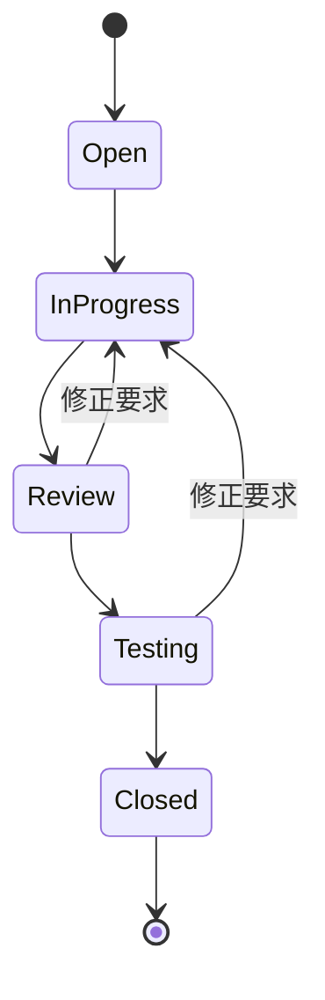

# Contributing Guide

本プロジェクトへのコントリビューションガイドです。

## 目次

- [基本原則](#基本原則)
- [開発環境のセットアップ](#開発環境のセットアップ)
- [Issue 駆動開発](#issue-駆動開発)
- [Git 規約](#git-規約)
- [コードレビュー](#コードレビュー)
- [テスト](#テスト)

## 基本原則

1. **透明性** - すべての作業は Issue として可視化
2. **自動化** - 繰り返し作業は自動化
3. **品質優先** - コードレビューとテストを重視
4. **継続的改善** - プロセスの定期的な見直し

## 開発環境のセットアップ

```bash
# リポジトリのクローン
git clone git@github.com:ishinova/mamelog.git mamelog-app
cd mamelog-app

# 開発環境の初期化
mise trust && mise install && mise run bootstrap
```

## Issue 駆動開発

すべての作業は GitHub Issue から始まります。

### Issue の作成

Issue は GitHub Issue Forms を使用して作成してください:

- [Bug Report](.github/ISSUE_TEMPLATE/bug_report.yml) - バグの報告
- [Feature Request](.github/ISSUE_TEMPLATE/feature_request.yml) - 機能要望

### Issue のラベル

| ラベル            | 用途             |
| ----------------- | ---------------- |
| `type:feature`    | 新機能           |
| `type:fix`        | バグ修正         |
| `type:docs`       | ドキュメント     |
| `type:refactor`   | リファクタリング |
| `priority:high`   | 優先度高         |
| `priority:medium` | 優先度中         |
| `priority:low`    | 優先度低         |

### Issue のライフサイクル



## Git 規約

### ブランチ命名

Format: `{prefix}/GH-{issue-number}`

| 用途             | プレフィックス |
| ---------------- | -------------- |
| 新機能           | `feature/`     |
| バグ修正         | `fix/`         |
| ドキュメント     | `docs/`        |
| リファクタリング | `refactor/`    |
| CI/CD            | `ci/`          |
| メンテナンス     | `chore/`       |

### クイックリファレンス

```bash
# 新機能の開始
gh issue view 123
git checkout main && git pull origin main
git checkout -b feature/GH-123

# コミット (Conventional Commits 形式)
git commit -m "feat(app): 記録画面を追加"

# PR 作成
git push -u origin feature/GH-123
gh pr create --draft
```

PR 作成時は [PR テンプレート](.github/PULL_REQUEST_TEMPLATE.md) に従って記載してください。

## コードレビュー

### レビューコメントのプレフィックス

| プレフィックス | 意味           |
| -------------- | -------------- |
| `MUST`         | 必ず修正が必要 |
| `SHOULD`       | 修正を推奨     |
| `CONSIDER`     | 検討してほしい |
| `NITPICK`      | 細かい指摘     |
| `QUESTION`     | 質問           |

## テスト

```bash
# すべてのテストを実行
melos run test

# 静的解析
melos run analyze
```
