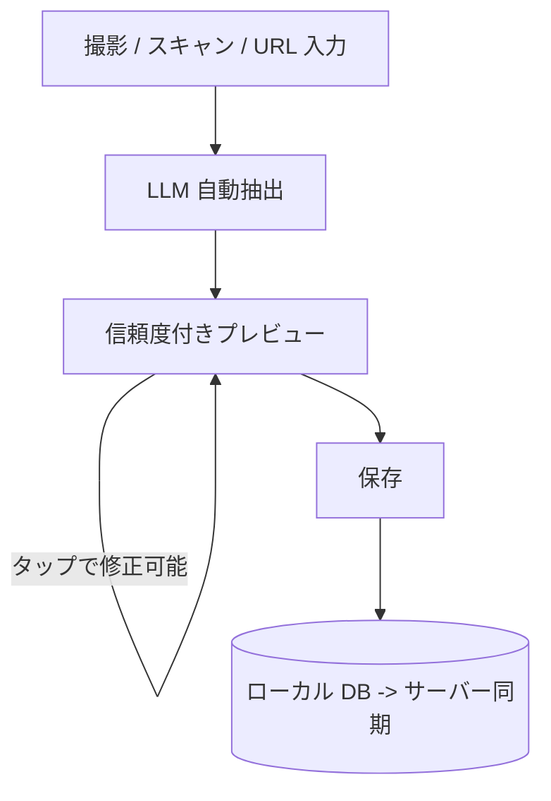

[](https://opensource.org/licenses/MIT)
[](https://github.com/invertase/melos)
[](https://app.renovatebot.com/dashboard)
[](https://flutter.dev)
[](https://dart.dev)

# mamelog (豆ろぐ)

コーヒー体験を写真から自動で記録・蓄積するパーソナルコーヒーライブラリアプリ。写真・QR コード・URL から LLM が情報を自動抽出し、手入力なしで構造化データとして保存する。

## 目次

- [概要](#概要)
- [主な機能](#主な機能)
- [技術スタック](#技術スタック)
- [プロジェクト構成](#プロジェクト構成)
- [クイックスタート](#クイックスタート)
- [開発](#開発)
- [アーキテクチャ](#アーキテクチャ)
- [ライセンス](#ライセンス)

## 概要

mamelog は「**撮るだけで記録完了**」をコア価値とするコーヒー記録アプリ。LLM による自動抽出で手入力をゼロにし、「記録が続かない」という課題を根本解決する。Flutter によるクロスプラットフォーム開発で iOS + Android に対応する。

### 対象ユーザー

- コーヒー愛好家（自宅抽出・カフェ巡り）
- ロースターやカフェの情報を記録・蓄積したい人

### 解決する課題

- コーヒー豆の情報を手入力する手間が大きく、記録が続かない
- 写真は撮るが構造化データとして蓄積できない
- オフライン環境（カフェ・イベント会場等）で記録できない

## 主な機能

### コーヒー情報の自動抽出

- **写真撮影** - カフェのカードや袋のラベルを撮るだけで LLM が自動抽出
- **QR コードスキャン** - QR から URL を取得し、Web ページから情報を抽出
- **URL 直接入力** - ロースターの商品ページ URL を貼るだけ
- **手動入力フォールバック** - 全フィールドを手動で入力可能

### 抽出結果のプレビュー・編集

- **カード型プレビュー** - 元の写真と抽出結果を並べて表示
- **信頼度スコア表示** - フィールドごとの抽出信頼度を3段階で可視化
- **タップ編集** - 各フィールドをタップして修正

### コーヒーライブラリ

- **一覧・詳細表示** - 写真サムネイル・ロースター名・産地で一覧表示
- **グリッド/リスト切替** - 表示形式を選択可能
- **検索・フィルタ** - ロースター名・産地・品種・焙煎度で絞り込み

### テイスティングノート

- **SCA カッピングプロトコル準拠** - classic / CVA 2024 の両プロトコル対応
- **レーダーチャート** - テイスティングスコアの視覚化
- **自由記述** - 感想やメモの記録

### オフライン対応

- **オフライン写真撮影** - ネットワークなしでも撮影・保存可能
- **自動同期** - オンライン復帰後に自動で LLM 抽出を実行

## 技術スタック

### フレームワーク・言語

- **Flutter / Dart** - バージョンは `mise.toml` で管理

### 状態管理・DI

- **GetIt + injectable** - 依存性注入 (DI)
- **flutter_bloc** - Cubit パターンによる状態管理
- **go_router** - StatefulShellRoute でタブナビゲーション管理

### ローカル DB

- **Drift** - 型安全な SQLite ORM。FTS5 全文検索、リアクティブストリーム対応

### 認証

- **Firebase Authentication** - Google Sign-in + Sign in with Apple

### 開発ツール

- **Melos** - モノレポ管理（コード生成・テスト・解析の一括実行）
- **mise** - ツールバージョン管理
- **Lefthook** - Git hooks
- **Renovate** - 依存関係の自動更新

## プロジェクト構成

Melos Monorepo の3レイヤー構成。依存は下方向のみ: `app/` -> `feature/` -> `core/`。

```
mamelog-app/
├── app/
│   ├── mobile/                         # エントリーポイントアプリ (iOS/Android)
│   └── shared/                         # 共有アプリレベルユーティリティ
├── core/
│   ├── authenticator/                  # 認証抽象
│   ├── common/                         # 共有ユーティリティ、拡張
│   ├── data/                           # Repository 実装
│   ├── database/                       # データベース抽象
│   ├── database_drift/                 # Drift (SQLite) 実装
│   ├── datastore/                      # Key-Value ストア抽象
│   ├── datastore_shared_preferences/   # SharedPreferences 実装
│   ├── designsystem/                   # デザイントークン、テーマ、共有ウィジェット
│   ├── domain/                         # ユースケース、Repository インターフェース
│   ├── model/                          # ドメインモデル、エンティティ
│   ├── network/                        # HTTP クライアント、API 抽象
│   ├── testing/                        # テストユーティリティ
│   └── ui/                             # 共有 UI コンポーネント
├── feature/
│   ├── auth/                           # 認証画面
│   ├── capture/                        # 写真/QR/URL キャプチャフロー
│   ├── library/                        # コーヒーライブラリ (一覧/詳細/編集)
│   ├── tasting/                        # テイスティングノート
│   └── stats/                          # 統計ダッシュボード
└── pubspec.yaml                        # ワークスペースルート (Melos)
```

### レイヤー依存ルール

| レイヤー   | 依存可能な対象                              |
| ---------- | ------------------------------------------- |
| `app/`     | `core/` と `feature/` の全パッケージ        |
| `feature/` | `core/` のみ（他の feature には依存しない） |
| `core/`    | 他の `core/` のみ                           |

feature パッケージは直接ナビゲーションせず、app レイヤーからのコールバックで画面遷移を委譲する。

## クイックスタート

### 前提条件

- macOS 14.0 以上
- Git
- 8GB 以上のメモリ（推奨: 16GB）

### 対象プラットフォーム

| プラットフォーム | 最低バージョン   |
| ---------------- | ---------------- |
| iOS              | 18以上           |
| Android          | 13 (API 33) 以上 |

### セットアップ

```bash
# 1. リポジトリのクローン
git clone https://github.com/mamelog/mamelog-app.git
cd mamelog-app

# 2. mise（開発環境管理ツール）のインストール
curl https://mise.run | sh
echo 'eval "$(~/.local/bin/mise activate bash)"' >> ~/.bashrc  # bash の場合
source ~/.bashrc

# 3. プロジェクトのセットアップ
mise trust && mise install && mise run bootstrap
```

### アプリの実行

```bash
# 開発環境
cd app/mobile && flutter run --no-pub --flavor dev

# ステージング環境
cd app/mobile && flutter run --no-pub --flavor stg

# 本番環境
cd app/mobile && flutter run --no-pub --flavor prod
```

## 開発

### よく使うコマンド

```bash
# コード生成（変更パッケージのみ、推奨）
melos run codegen:diff:head

# コード生成（全パッケージ）
melos run codegen

# 静的解析（全パッケージ）
melos run analyze --no-select

# テスト実行（全パッケージ）
melos run test --no-select

# フォーマット
melos run format

# 依存関係の検証
melos run deps:validate
```

### 開発フロー

1. **Issue 作成** - 作業内容を明確化
2. **ブランチ作成** - `feature/GH-{issue 番号}`
3. **実装** - TDD（Red -> Green -> Refactor）
4. **テスト** - Unit / Widget / Integration テスト
5. **PR 作成** - レビュー依頼
6. **マージ** - マージコミットで統合

## アーキテクチャ

### コア UX フロー



- **デフォルト:** 撮影 -> プレビュー -> 保存（約10-15秒）
- **設定で切替可能:** 撮影 -> 即保存 -> 後で確認

### システム構成

```
Flutter App -> REST API -> PostgreSQL
           -> Firebase Auth (トークン検証)
           -> Cloud Storage (画像)
           -> LLM (コーヒー情報抽出)
```

### オフラインファースト

Flutter 公式のオフラインファーストパターンに準拠する。

| 操作     | 方式                                                         |
| -------- | ------------------------------------------------------------ |
| ローカル | Drift (SQLite) をデバイス上のソースオブトゥルースとする      |
| 読み取り | ストリームベース（ローカルを即時表示 -> リモート更新を反映） |
| 書き込み | ローカルに先行保存 -> 接続復帰時にサーバーへ同期             |
| 同期     | `connectivity_plus` でネットワーク復帰を検知 -> API へ同期   |

### 環境分離

Flavor (`dev` / `stg` / `prod`) で Firebase プロジェクトや接続先 API を切り替える。

### 設計原則

1. **依存性の逆転** - 抽象に依存、具象に依存しない
2. **単一責任の原則** - 各クラスは1つの責務
3. **オフラインファースト** - ネットワーク状態に関わらず基本機能を保証

## ライセンス

このプロジェクトは MIT License のもとで公開しています。詳細は [LICENSE](LICENSE) ファイルを参照してください。

---

<p align="center">
  Made by Ishinova Inc.
</p>
