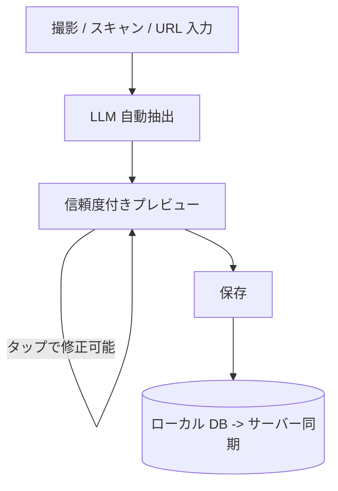

[](https://opensource.org/licenses/MIT)
[](https://github.com/invertase/melos)
[](https://app.renovatebot.com/dashboard)
[](https://flutter.dev)
[](https://dart.dev)

# mamelog (豆ろぐ)

コーヒー体験を写真から自動で記録・蓄積するパーソナルコーヒーライブラリアプリ。写真・QR コード・URL から LLM (Large Language Model) が情報を自動抽出し、手入力なしで構造化データとして保存する。

> **現在のステータス:** M1 基盤構築フェーズ。ディレクトリ構成とツールチェーンを整備中。Dart ソースコードは未実装。

## 目次

- [概要](#概要)
- [主な機能](#主な機能)
- [技術スタック](#技術スタック)
- [プロジェクト構成](#プロジェクト構成)
- [クイックスタート](#クイックスタート)
- [開発](#開発)
- [アーキテクチャ](#アーキテクチャ)
- [開発ツール](#開発ツール)
- [Git フック](#git-フック)
- [コミット規約](#コミット規約)
- [npm スクリプト](#npm-スクリプト)
- [CI / GitHub Actions](#ci--github-actions)
- [設計ドキュメント](#設計ドキュメント)
- [MVP スコープ](#mvp-スコープ)
- [ライセンス](#ライセンス)

## 概要

mamelog は「**撮るだけで記録完了**」をコア価値とするコーヒー記録アプリ。LLM による自動抽出で手入力をゼロにし、「記録が続かない」という課題を根本解決する。Flutter によるクロスプラットフォーム開発で iOS + Android に対応する。

### 対象ユーザー

- コーヒー愛好家（自宅抽出・カフェ巡り）
- ロースターやカフェの情報を記録・蓄積したい人

### 解決する課題

- コーヒー豆の情報を手入力する手間が大きく、記録が続かない
- 写真は撮るが構造化データとして蓄積できない
- オフライン環境（カフェ・イベント会場等）で記録できない

## 主な機能

### コーヒー情報の自動抽出

- **写真撮影** - カフェのカードや袋のラベルを撮るだけで LLM が自動抽出
- **QR コードスキャン** - QR から URL を取得し、Web ページから情報を抽出
- **URL 直接入力** - ロースターの商品ページ URL を貼るだけ
- **手動入力フォールバック** - 全フィールドを手動で入力可能

### 抽出結果のプレビュー・編集

- **カード型プレビュー** - 元の写真と抽出結果を並べて表示
- **信頼度スコア表示** - フィールドごとの抽出信頼度を3段階で可視化
- **タップ編集** - 各フィールドをタップして修正

### コーヒーライブラリ

- **一覧・詳細表示** - 写真サムネイル・ロースター名・産地で一覧表示
- **グリッド/リスト切替** - 表示形式を選択可能
- **検索・フィルタ** - ロースター名・産地・品種・焙煎度で絞り込み

### テイスティングノート

- **SCA (Specialty Coffee Association) カッピングプロトコル準拠** - classic / CVA 2024 の両プロトコル対応
- **レーダーチャート** - テイスティングスコアの視覚化
- **自由記述** - 感想やメモの記録

### オフライン対応

- **オフライン写真撮影** - ネットワークなしでも撮影可能。オンライン復帰後に LLM 抽出を実行
- **自動同期** - オンライン復帰後に自動で LLM 抽出を実行

## 技術スタック

### フレームワーク・言語

- **Flutter / Dart** - バージョンは `mise.toml` で管理予定（M1 フェーズで設定）

### Flutter パッケージスタック

確定済みパッケージ一覧。バージョンは調査時点 (2026-03-03) のもので、各パッケージの `pubspec.yaml` 作成時に確定する。

| カテゴリ                      | パッケージ                              | バージョン    | 備考                                                      |
| ----------------------------- | --------------------------------------- | ------------- | --------------------------------------------------------- |
| **状態管理**                  | `flutter_bloc`                          | 9.1.1         | Cubit 80% + Bloc 20% の使い分け                           |
|                               | `bloc`                                  | 9.2.0         | flutter_bloc の依存                                       |
| **DI (Dependency Injection)** | `get_it`                                | 9.2.1         | O(1) サービスロケーター                                   |
|                               | `injectable` + `injectable_generator`   | 2.7.1+4       | アノテーションベース DI コード生成                        |
| **不変データモデル**          | `freezed` + `freezed_annotation`        | 3.2.5 / 3.1.0 | sealed class + copyWith + equality 自動生成               |
| **JSON シリアライズ**         | `json_serializable` + `json_annotation` | 6.13.0        | API レスポンスモデルの JSON 変換                          |
| **等価比較**                  | `equatable`                             | 2.0.8         | Freezed 不使用時のフォールバック                          |
| **ルーティング**              | `go_router`                             | 17.1.0        | StatefulShellRoute でタブナビゲーション                   |
| **ローカル DB**               | `drift`                                 | 2.31.0        | 型安全 SQLite ORM。FTS5 (Full-Text Search 5) 全文検索対応 |
| **認証**                      | `firebase_auth`                         | 6.1.4         | Google + Apple Sign-in                                    |
| **Google ログイン**           | `google_sign_in`                        | 7.2.0         | Google アカウント認証                                     |
| **Apple ログイン**            | `sign_in_with_apple`                    | 7.0.1         | Apple ID 認証                                             |
| **カメラ (MVP)**              | `image_picker`                          | 1.2.1         | システムカメラ UI                                         |
| **QR スキャン**               | `mobile_scanner`                        | 7.2.0         | v7.2.0 で日本語 UTF-8 修正済み                            |
| **画像圧縮**                  | `flutter_image_compress`                | 2.4.0         | WebP 圧縮                                                 |
| **画像キャッシュ**            | `cached_network_image`                  | 3.4.1         | ネットワーク画像キャッシュ                                |
| **権限管理**                  | `permission_handler`                    | 12.0.1        | カメラ等のランタイム権限                                  |
| **接続状態**                  | `connectivity_plus`                     | 7.0.0         | オフライン検知                                            |
| **コード生成**                | `build_runner`                          | ※1            | Freezed + injectable + json_serializable                  |
| **エラーハンドリング**        | 自前 Result sealed class                | --            | Flutter 公式パターン準拠                                  |

※1: `build_runner` のバージョンは Flutter SDK との互換性に依存するため、セットアップ時に決定する。

### 開発ツール

- **Melos** - モノレポ管理（コード生成・テスト・解析の一括実行）
- **mise** - ツールバージョン管理
- **Lefthook** - Git hooks
- **Renovate** - 依存関係の自動更新

## プロジェクト構成

Melos Monorepo の3レイヤー構成。依存は下方向のみ: `app/` -> `feature/` -> `core/`。

```
mamelog-app/
├── app/
│   ├── mobile/                         # エントリーポイントアプリ (iOS/Android)
│   └── shared/                         # 共有アプリレベルユーティリティ
├── core/
│   ├── authenticator/                  # 認証抽象
│   ├── common/                         # 共有ユーティリティ、拡張
│   ├── data/                           # Repository 実装
│   ├── database/                       # データベース抽象
│   ├── database_drift/                 # Drift (SQLite) 実装
│   ├── datastore/                      # Key-Value ストア抽象
│   ├── datastore_shared_preferences/   # SharedPreferences 実装
│   ├── designsystem/                   # デザイントークン、テーマ、共有ウィジェット
│   ├── domain/                         # ユースケース、Repository インターフェース
│   ├── model/                          # ドメインモデル、エンティティ
│   ├── network/                        # HTTP クライアント、API 抽象
│   ├── testing/                        # テストユーティリティ
│   └── ui/                             # 共有 UI コンポーネント
├── feature/
│   ├── auth/                           # 認証画面
│   ├── capture/                        # 写真/QR/URL キャプチャフロー
│   ├── library/                        # コーヒーライブラリ (一覧/詳細/編集)
│   ├── tasting/                        # テイスティングノート
│   └── stats/                          # 統計ダッシュボード
└── pubspec.yaml                        # ワークスペースルート (Melos) ※未作成
```

### レイヤー依存ルール

| レイヤー   | 依存可能な対象                              |
| ---------- | ------------------------------------------- |
| `app/`     | `core/` と `feature/` の全パッケージ        |
| `feature/` | `core/` のみ（他の feature には依存しない） |
| `core/`    | 他の `core/` のみ                           |

feature パッケージは直接ナビゲーションせず、app レイヤーからのコールバックで画面遷移を委譲する。

## クイックスタート

### 前提条件

- macOS 14.0 以上
- Git
- 8GB 以上のメモリ（推奨: 16GB）

### 対象プラットフォーム

| プラットフォーム | 最低バージョン   |
| ---------------- | ---------------- |
| iOS              | 18以上           |
| Android          | 13 (API 33) 以上 |

### セットアップ

```bash
# 1. リポジトリのクローン
git clone https://github.com/mamelog/mamelog-app.git
cd mamelog-app

# 2. mise（開発環境管理ツール）のインストール
curl https://mise.run | sh
echo 'eval "$(~/.local/bin/mise activate bash)"' >> ~/.bashrc  # bash の場合
source ~/.bashrc

# 3. プロジェクトのセットアップ
mise trust && mise install && mise run bootstrap
```

### アプリの実行

M1 基盤構築の完了後に使用可能。

```bash
# 開発環境
cd app/mobile && flutter run --no-pub --flavor dev

# ステージング環境
cd app/mobile && flutter run --no-pub --flavor stg

# 本番環境
cd app/mobile && flutter run --no-pub --flavor prod
```

## 開発

### よく使うコマンド

以下の Melos コマンドは M1 基盤構築（pubspec.yaml 作成）の完了後に使用可能。Melos 設定はルートの pubspec.yaml の `melos` キーに埋め込む（melos.yaml は非推奨）。

```bash
# コード生成（変更パッケージのみ、推奨）
melos run codegen:diff:head

# コード生成（全パッケージ）
melos run codegen

# 静的解析（全パッケージ）
melos run analyze --no-select

# テスト実行（全パッケージ）
melos run test --no-select

# フォーマット
melos run format

# 依存関係の検証
melos run deps:validate
```

### 開発フロー

このリポジトリは **Trunk-Based Development** を採用している。`main` ブランチを常にリリース可能な状態に保ち、短命のフィーチャーブランチで開発を行う。

```
feature branch --> PR --> main (trunk)
```

1. **Issue 作成** -- 作業内容を明確化
2. **ブランチ作成** -- `feature/GH-{issue 番号}` を `main` から作成
3. **実装** -- TDD (Red -> Green -> Refactor)
4. **テスト** -- Unit / Widget / Integration テスト
5. **PR 作成** -- レビュー依頼
6. **マージ** -- main にマージ後、フィーチャーブランチを削除

## アーキテクチャ

### コア UX フロー


```mermaid
flowchart TD
    A[撮影 / スキャン / URL 入力] --> B[LLM 自動抽出]
    B --> C[信頼度付きプレビュー]
    C -- タップで修正可能 --> C
    C --> D[保存]
    D --> E[(ローカル DB -> サーバー同期)]
```

- **デフォルト:** 撮影 -> プレビュー -> 保存（約10-15秒）
- **設定で切替可能:** 撮影 -> 即保存 -> 後で確認

### システム構成

```
Flutter App -> REST API -> サーバー
           -> Firebase Auth (トークン検証)
           -> LLM (コーヒー情報抽出)
```

### オフラインファースト

Flutter 公式のオフラインファーストパターンに準拠する。

| 操作     | 方式                                                         |
| -------- | ------------------------------------------------------------ |
| ローカル | Drift (SQLite) をデバイス上のソースオブトゥルースとする      |
| 読み取り | ストリームベース（ローカルを即時表示 -> リモート更新を反映） |
| 書き込み | ローカルに先行保存 -> 接続復帰時にサーバーへ同期             |
| 同期     | `connectivity_plus` でネットワーク復帰を検知 -> API へ同期   |

### 環境分離

Flavor (`dev` / `stg` / `prod`) で Firebase プロジェクトや接続先 API を切り替える。

| Flavor | 用途                   | Firebase プロジェクト | API 接続先        |
| ------ | ---------------------- | --------------------- | ----------------- |
| `dev`  | ローカル開発・デバッグ | 開発用                | 開発 API サーバー |
| `stg`  | ステージング検証       | ステージング用        | STG API サーバー  |
| `prod` | 本番リリース           | 本番用                | 本番 API サーバー |

実行コマンドは [アプリの実行](#アプリの実行) を参照。

### 認証フロー

Firebase Authentication による認証。アプリは Firebase ID トークンを REST API に送信し、サーバー側でユーザーごとのデータ分離を行う。

```
Flutter App
  |-- firebase_auth で認証 (Google / Apple / 匿名)
  |-- Firebase ID トークンを Authorization ヘッダーに付与
  v
REST API サーバー
  |-- トークン検証 -> ユーザー識別
  |-- ユーザーごとのデータ分離
```

### データモデル概要

ローカル DB に12エンティティを保持。詳細は [データモデル仕様](docs/data-model.md) を参照。

| 区分           | エンティティ                                                 |
| -------------- | ------------------------------------------------------------ |
| ユーザーデータ | users, roasters, beans, bean_origins, bean_flavor_notes      |
| 記録・評価     | tasting_notes, brew_recipes, drink_logs                      |
| マスターデータ | countries, varieties, processing_methods, flavor_descriptors |

主キーは全テーブル UUIDv7 (時刻順ソート可能な UUID)。ユーザーデータは soft delete (`deleted_at`)。

### 設計決定サマリー

モバイルアプリに関する主要な設計判断の一覧。

| カテゴリ               | 決定事項                  |
| ---------------------- | ------------------------- |
| モバイルフレームワーク | Flutter                   |
| 状態管理               | BLoC (Cubit + Bloc)       |
| DI                     | Injectable + get_it       |
| 不変データモデル       | Freezed 3.x               |
| ルーティング           | go_router                 |
| ローカル DB            | Drift (SQLite)            |
| 認証方式               | Firebase Authentication   |
| API 通信               | REST (URL バージョニング) |

### 設計原則

1. **依存性の逆転** - 抽象に依存、具象に依存しない
2. **単一責任の原則** - 各クラスは1つの責務
3. **オフラインファースト** - ネットワーク状態に関わらず基本機能を保証

## 開発ツール

| ツール                                              | 用途                                          |
| --------------------------------------------------- | --------------------------------------------- |
| [mise](https://mise.jdx.dev/)                       | 開発ツールのバージョン管理                    |
| [Bun](https://bun.sh/)                              | JavaScript ランタイム・パッケージマネージャー |
| [actionlint](https://github.com/rhysd/actionlint)   | GitHub Actions ワークフローの静的解析         |
| [pinact](https://github.com/suzuki-shunsuke/pinact) | GitHub Actions のコミット SHA ピン留め        |

各ツールのバージョンは `mise.toml` で管理する。mise を導入すれば `mise install` で自動インストールされる。npm パッケージのバージョンは `package.json` を参照。

## Git フック

[lefthook](https://lefthook.dev/) で以下の Git フックを管理している。

### pre-commit

| コマンド   | 優先度 | 対象ファイル                        | 内容                    |
| ---------- | ------ | ----------------------------------- | ----------------------- |
| dprint     | 1      | `*.md`, `*.yaml`, `*.yml`, `*.json` | フォーマット自動修正    |
| pinact     | 1      | `.github/workflows/*.yml`, `*.yaml` | Actions の SHA ピン留め |
| actionlint | 2      | `.github/workflows/*.yml`, `*.yaml` | ワークフロー静的解析    |
| doc-lint   | 3      | `*.md`                              | ドキュメント構造検証    |

### commit-msg

[commitlint](https://commitlint.js.org/) によるコミットメッセージの検証。Conventional Commits 形式を強制する。

### post-merge / post-checkout

`mise.toml` や `package.json` / `bun.lock` の変更を検知して、ツールや依存パッケージを自動インストールする。

## コミット規約

[Conventional Commits](https://www.conventionalcommits.org/) に準拠する。

**形式:** `type(scope): 説明`

### type 一覧

`feat`, `fix`, `docs`, `style`, `refactor`, `perf`, `test`, `build`, `ci`, `chore`, `revert`

### scope 一覧

| scope     | 対象                      |
| --------- | ------------------------- |
| `app`     | app/ 配下のパッケージ     |
| `core`    | core/ 配下のパッケージ    |
| `feature` | feature/ 配下のパッケージ |

scope は省略可能。複数スコープにまたがる変更の場合は省略する。

## npm スクリプト

| コマンド             | 説明                                                     |
| -------------------- | -------------------------------------------------------- |
| `bun run format`     | [dprint](https://dprint.dev/) によるフォーマットチェック |
| `bun run format:fix` | dprint によるフォーマット自動修正                        |
| `bun run lint:docs`  | ドキュメント構造リンター                                 |
| `bun run prepare`    | lefthook の Git hooks をインストール                     |

## CI / GitHub Actions

Pull Request に対して以下のワークフローが実行される。

| ワークフロー   | トリガー        | 内容                                                               |
| -------------- | --------------- | ------------------------------------------------------------------ |
| PR: Checks     | PR 作成・更新   | actionlint によるワークフロー検証、ドキュメント構造リンター        |
| Weekly: Doc GC | 毎週月曜 / 手動 | 鮮度チェック + 品質スコア更新。陳腐化ドキュメントの Issue 自動作成 |

## 設計ドキュメント

本リポジトリ内の設計ドキュメント。

| ドキュメント                                    | 内容                                                        |
| ----------------------------------------------- | ----------------------------------------------------------- |
| [アーキテクチャ設計](docs/architecture.md)      | レイヤー構成、状態管理、DI、データフロー、ナビゲーション    |
| [データモデル仕様](docs/data-model.md)          | 全12エンティティ定義、ER 図、Drift テーブル、Freezed モデル |
| [開発ガイド](docs/development-guide.md)         | 環境構築、Flavor 設定、コード生成、テスト、コミット規約     |
| [黄金原則](docs/golden-principles.md)           | ドキュメント品質基準                                        |
| [機械的強制ルール](docs/enforcement.md)         | リンター・CI で自動検証されるルール                         |
| [実装ステータス](docs/implementation-status.md) | パッケージ、機能、マイルストーンの実装進捗                  |

## MVP スコープ

コア価値「**撮るだけで記録完了**」を実現する最小限の機能セット。P0 (MVP 必須) として以下の11機能を定義している。

| ID    | 機能                      | 概要                                                |
| ----- | ------------------------- | --------------------------------------------------- |
| F-001 | ユーザー認証              | Google Sign-in + Sign in with Apple (Firebase Auth) |
| F-002 | 写真撮影による自動抽出    | カメラ撮影 -> LLM が12以上のフィールドを自動抽出    |
| F-003 | QR コードスキャン         | QR -> URL -> Web ページから LLM 抽出                |
| F-004 | URL 直接入力              | 商品ページ URL から LLM 抽出                        |
| F-005 | カード型プレビュー + 編集 | 信頼度バッジ付き抽出結果の確認・タップ編集          |
| F-006 | 手動入力フォールバック    | 全フィールドの手動入力                              |
| F-007 | エントリ保存              | コーヒー情報をクラウド保存                          |
| F-008 | コーヒーライブラリ        | 一覧表示 + 詳細表示                                 |
| F-009 | 簡易テイスティングノート  | 星評価 (1-5) + 自由メモ                             |
| F-010 | オフライン撮影 + 自動抽出 | オフラインで撮影、オンライン復帰後に自動 LLM 抽出   |
| F-011 | アカウント削除            | Apple App Store 要件準拠の全データ削除              |

## ライセンス

このプロジェクトは MIT License のもとで公開しています。詳細は [LICENSE](LICENSE) ファイルを参照してください。

---

<p align="center">
  Made by Ishinova Inc.
</p>
