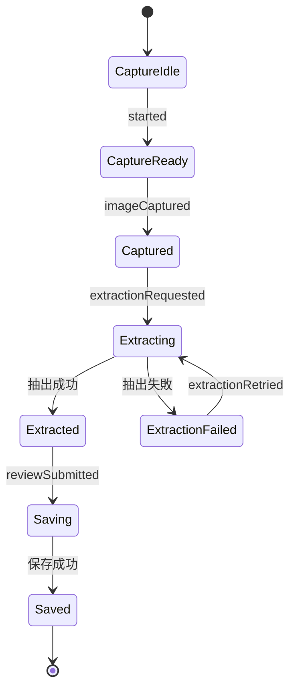
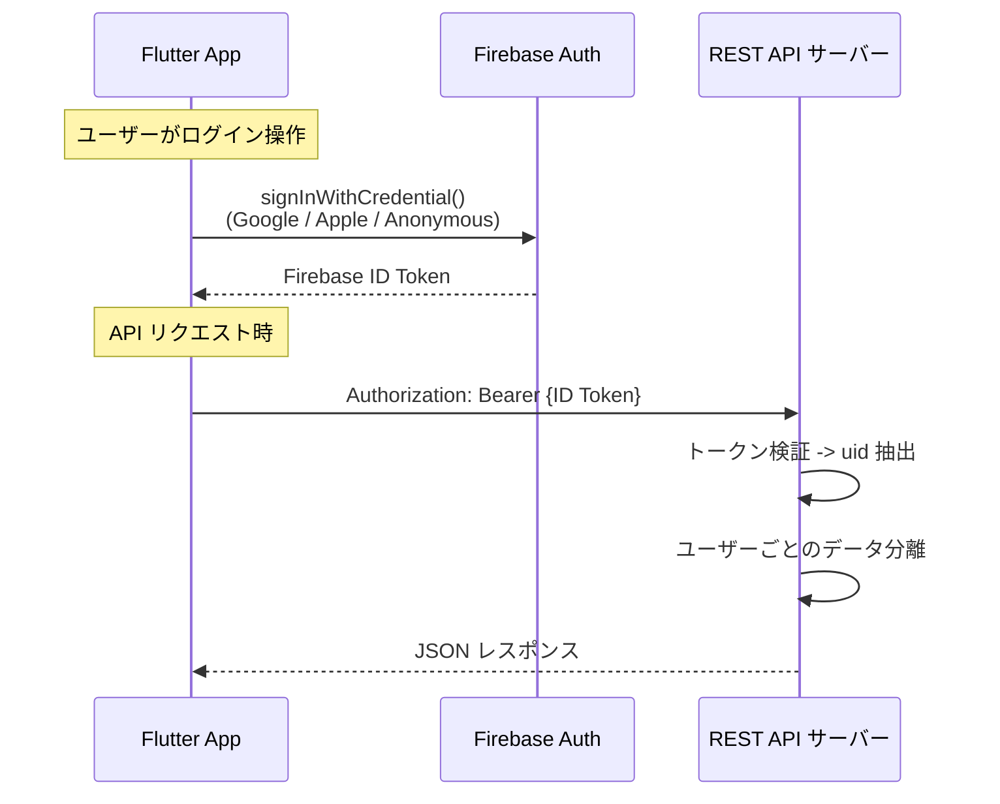

# Flutter アーキテクチャ設計

## 概要

mamelog Flutter アプリのアーキテクチャ全体像を解説するドキュメント。コーヒー体験を写真から自動記録するモバイルアプリとして、BLoC パターンによる状態管理、Injectable + get_it による依存性注入、オフラインファーストのデータフロー、go_router によるナビゲーション、Firebase Auth による認証を統合した設計を定める。

本ドキュメントは確定済みの設計方針を実装構造に落とし込んだ Explanation（理解指向）ドキュメントである。

## レイヤー構成

mamelog-app は Melos Monorepo の3レイヤー構成を採用する。BLoC 公式アーキテクチャガイドに準拠し、Presentation Layer / Business Logic Layer / Data Layer を明確に分離する。

### 依存方向

依存は常に上位レイヤーから下位レイヤーへの一方向のみ許可される。

| レイヤー   | 依存可能な対象                       | 制約                                                                |
| ---------- | ------------------------------------ | ------------------------------------------------------------------- |
| `app/`     | `core/` と `feature/` の全パッケージ | エントリーポイント。ナビゲーション統合と DI 初期化を担当            |
| `feature/` | `core/` のみ                         | 他の feature パッケージへの依存は禁止。画面遷移はコールバックで委譲 |
| `core/`    | 他の `core/` のみ                    | 抽象と実装を分離。ドメインロジックに外部依存を持ち込まない          |

### 依存方向図

```mermaid
graph TD
    subgraph "app/ レイヤー"
        A_MOBILE["app/mobile<br/>iOS/Android エントリーポイント"]
        A_SHARED["app/shared<br/>アプリレベル共有ユーティリティ"]
    end

    subgraph "feature/ レイヤー"
        F_AUTH["feature/auth<br/>認証画面"]
        F_CAPTURE["feature/capture<br/>キャプチャフロー"]
        F_LIBRARY["feature/library<br/>コーヒーライブラリ"]
        F_TASTING["feature/tasting<br/>テイスティングノート"]
        F_STATS["feature/stats<br/>統計ダッシュボード"]
    end

    subgraph "core/ レイヤー"
        C_DOMAIN["core/domain<br/>ユースケース, Repository I/F"]
        C_MODEL["core/model<br/>ドメインモデル, エンティティ"]
        C_DATA["core/data<br/>Repository 実装"]
        C_DB["core/database<br/>データベース抽象"]
        C_DB_DRIFT["core/database_drift<br/>Drift 実装"]
        C_DS["core/datastore<br/>Key-Value 抽象"]
        C_DS_SP["core/datastore_shared_preferences<br/>SharedPreferences 実装"]
        C_AUTH["core/authenticator<br/>認証抽象"]
        C_NET["core/network<br/>HTTP クライアント, API 抽象"]
        C_COMMON["core/common<br/>共有ユーティリティ"]
        C_DS_SYS["core/designsystem<br/>デザイントークン, テーマ"]
        C_UI["core/ui<br/>共有 UI コンポーネント"]
        C_TEST["core/testing<br/>テストユーティリティ"]
    end

    A_MOBILE --> A_SHARED
    A_MOBILE --> F_AUTH
    A_MOBILE --> F_CAPTURE
    A_MOBILE --> F_LIBRARY
    A_MOBILE --> F_TASTING
    A_MOBILE --> F_STATS

    F_AUTH --> C_DOMAIN
    F_AUTH --> C_MODEL
    F_AUTH --> C_UI
    F_CAPTURE --> C_DOMAIN
    F_CAPTURE --> C_MODEL
    F_CAPTURE --> C_UI
    F_LIBRARY --> C_DOMAIN
    F_LIBRARY --> C_MODEL
    F_LIBRARY --> C_UI
    F_TASTING --> C_DOMAIN
    F_TASTING --> C_MODEL
    F_TASTING --> C_UI
    F_STATS --> C_DOMAIN
    F_STATS --> C_MODEL
    F_STATS --> C_UI

    C_DATA --> C_DOMAIN
    C_DATA --> C_DB
    C_DATA --> C_NET
    C_DB_DRIFT --> C_DB
    C_DS_SP --> C_DS
    C_DOMAIN --> C_MODEL
    C_UI --> C_DS_SYS
    C_UI --> C_COMMON
```



### パッケージ一覧

21パッケージで構成される。各パッケージの責務は以下のとおり。

| レイヤー | パッケージ                          | 責務                                                     |
| -------- | ----------------------------------- | -------------------------------------------------------- |
| app      | `app/mobile`                        | iOS/Android エントリーポイント。Flavor 分離、DI 初期化   |
| app      | `app/shared`                        | アプリレベルの共有ユーティリティ                         |
| feature  | `feature/auth`                      | 認証画面（ログイン、オンボーディング）                   |
| feature  | `feature/capture`                   | キャプチャフロー（写真/QR/URL 入力、LLM 抽出、レビュー） |
| feature  | `feature/library`                   | コーヒーライブラリ（一覧、詳細、編集）                   |
| feature  | `feature/tasting`                   | テイスティングノート（記録追加、詳細、編集）             |
| feature  | `feature/stats`                     | 統計ダッシュボード                                       |
| core     | `core/domain`                       | ユースケース、Repository インターフェース                |
| core     | `core/model`                        | ドメインモデル、エンティティ（Freezed で生成）           |
| core     | `core/data`                         | Repository 実装（ローカル + リモートの統合）             |
| core     | `core/database`                     | データベース抽象インターフェース                         |
| core     | `core/database_drift`               | Drift (SQLite) による database 実装                      |
| core     | `core/datastore`                    | Key-Value ストア抽象インターフェース                     |
| core     | `core/datastore_shared_preferences` | SharedPreferences による datastore 実装                  |
| core     | `core/authenticator`                | 認証抽象インターフェース                                 |
| core     | `core/network`                      | HTTP クライアント、API 抽象                              |
| core     | `core/common`                       | 共有ユーティリティ、拡張メソッド                         |
| core     | `core/designsystem`                 | デザイントークン、Material Design 3 テーマ               |
| core     | `core/ui`                           | 共有 UI コンポーネント                                   |
| core     | `core/testing`                      | テストユーティリティ、モック、フィクスチャ               |

## 状態管理

BLoC パターン（flutter_bloc + bloc）を採用する。Cubit をデフォルトとし、複雑なユースケースでのみ Bloc を使用する。比率は Cubit 80% + Bloc 20% を想定している。

### Cubit vs Bloc の使い分けガイドライン

| 側面             | Cubit                                  | Bloc                                    |
| ---------------- | -------------------------------------- | --------------------------------------- |
| 複雑さ           | 最小ボイラープレート、直接メソッド呼出 | Event クラス必須、イベント駆動          |
| トレーサビリティ | state 変更のみ表示                     | 何のイベントがトリガーか表示            |
| イベント変換     | 未対応                                 | `debounceTime`, `throttle`, `buffer` 等 |
| 推奨用途         | シンプルな UI ロジック (~80%)          | 複雑フロー、認証、検索 debounce (~20%)  |
| 判断基準         | 単一操作 -> 単一状態変更               | 複数ステップの非同期フロー、リトライ    |

### mamelog での適用マッピング

| 画面/機能        | Cubit / Bloc | 理由                                                 |
| ---------------- | ------------ | ---------------------------------------------------- |
| ライブラリ一覧   | Cubit        | フィルタ・ソートのシンプルな状態変更                 |
| コーヒー詳細     | Cubit        | 単一エンティティの読み込み・表示                     |
| 記録追加・編集   | Cubit        | フォーム入力の状態管理                               |
| キャプチャフロー | Bloc         | 複数ステップの非同期フロー、エラーリトライ           |
| 認証             | Bloc         | Firebase Auth のストリーム監視、トークンリフレッシュ |
| 検索             | Bloc         | debounce によるリアルタイム検索                      |

### キャプチャフロー状態遷移図

キャプチャフローはアプリのコア機能（写真撮影 -> LLM 抽出 -> レビュー -> 保存）を担う。複数ステップの非同期処理とエラーリトライを含むため、イベント駆動の Bloc を使用し、Freezed 3.x の sealed class で状態を定義する。



状態定義は Freezed 3.x の sealed class で表現し、Dart 3 のネイティブ `switch` 式で exhaustive pattern matching を行う。

```dart
// States (Freezed)
@freezed
sealed class CaptureState with _$CaptureState {
  const factory CaptureState.idle() = CaptureIdle;
  const factory CaptureState.ready() = CaptureReady;
  const factory CaptureState.captured({required String imagePath}) = Captured;
  const factory CaptureState.extracting({required String imagePath}) = Extracting;
  const factory CaptureState.extracted({
    required String imagePath,
    required Map<String, dynamic> extractedData,
    required Map<String, double> confidenceScores,
  }) = Extracted;
  const factory CaptureState.extractionFailed({
    required String imagePath,
    required String error,
  }) = ExtractionFailed;
  const factory CaptureState.saving() = Saving;
  const factory CaptureState.saved({required String beanId}) = Saved;
}
```

### BLoC 間の共有状態パターン (Reactive Repository)

BLoC 間で直接依存しない。共有状態は Repository 層の Stream を通じて伝播する（Reactive Repository パターン）。

| パターン               | 推奨度 | 説明                                                   |
| ---------------------- | ------ | ------------------------------------------------------ |
| Reactive Repository    | 推奨   | BLoC が共有 Repository の Stream を独立購読            |
| BlocListener (UI 層)   | 許容   | UI 層で BLoC A を listen -> BLoC B にイベント dispatch |
| BLoC 直接依存          | 非推奨 | 密結合。BLoC 公式アーキテクチャガイド違反              |
| グローバルイベントバス | 非推奨 | ライフサイクル管理困難、デバッグ困難                   |

Reactive Repository パターンでは、Repository が `Stream<T>` を公開し、複数の BLoC がそれぞれ独立して購読する。あるBLoC がデータを更新すると、Repository 経由で他の BLoC に自動的に変更が伝播する。

## 依存性注入 (DI)

Injectable + get_it をアノテーションベースの DI フレームワークとして採用する。get_it は O(1) のサービスロケーターとして動作し、Injectable がコード生成でボイラープレートを削減する。

### 初期化順序

アプリ起動時の DI 初期化は、依存関係の順序を守って実行する。

```
1. core/common        -- ユーティリティ、設定値
2. core/network       -- HTTP クライアント
3. core/authenticator -- Firebase Auth
4. core/database_drift -- Drift DB インスタンス
5. core/datastore_shared_preferences -- Key-Value ストア
6. core/data          -- Repository 実装（DB + Network に依存）
7. core/domain        -- ユースケース（Repository に依存）
8. feature/*          -- 各 feature の BLoC/Cubit（Domain に依存）
```

### モジュールパターン (@GeneratedMicroModule)

各パッケージは独自の DI モジュールを `@GeneratedMicroModule` アノテーションで定義する。これにより、パッケージ単位でのモジュール分離と、ルート（`app/mobile`）での統合が可能になる。

```
app/mobile (ルート)
  +-- @GeneratedMicroModule: core/authenticator
  +-- @GeneratedMicroModule: core/database_drift
  +-- @GeneratedMicroModule: core/datastore_shared_preferences
  +-- @GeneratedMicroModule: core/data
  +-- @GeneratedMicroModule: core/domain
  +-- @GeneratedMicroModule: feature/auth
  +-- @GeneratedMicroModule: feature/capture
  +-- @GeneratedMicroModule: feature/library
  +-- @GeneratedMicroModule: feature/tasting
  +-- @GeneratedMicroModule: feature/stats
```

### 環境別設定 (@Environment)

Injectable の `@Environment` アノテーションで Flavor ごとの実装を切り替える。

| 環境   | 用途                                     |
| ------ | ---------------------------------------- |
| `dev`  | 開発環境。モック API、デバッグログ有効   |
| `stg`  | ステージング。本番相当だがテストデータ   |
| `prod` | 本番環境。実 API、クラッシュレポート有効 |

## データフロー

Flutter 公式のオフラインファーストパターンに準拠する。Drift (SQLite) をデバイスのソースオブトゥルースとし、REST API 経由でサーバーと同期する。

### オフラインファーストアーキテクチャ

| 操作     | 方式                                                                     |
| -------- | ------------------------------------------------------------------------ |
| ローカル | Drift (SQLite) をデバイス上のソースオブトゥルースとする                  |
| 読み取り | ストリームベース（ローカルを即時表示 -> リモート更新を反映）             |
| 書き込み | オフラインファースト（ローカルに先行保存 -> 接続復帰時にサーバーへ同期） |
| 同期     | `connectivity_plus` でネットワーク復帰を検知 -> REST API へ同期          |

### Repository パターン

Repository はデータソース（ローカル DB + リモート API）を統合する唯一の窓口として機能する。BLoC/Cubit は Repository の抽象インターフェースにのみ依存し、データの取得元を意識しない。

```
BLoC / Cubit
  |
  v
Repository (interface: core/domain)
  |
  +-- Repository (impl: core/data)
       |
       +-- Local Data Source (core/database_drift)
       |     +-- Drift (SQLite) -- ソースオブトゥルース
       |
       +-- Remote Data Source (core/network)
             +-- REST API サーバー
```

読み取りフロー:

1. BLoC が Repository の `Stream<T>` を購読
2. Repository がローカル DB のデータを即時 emit
3. バックグラウンドで REST API を呼び出し、レスポンスをローカル DB に保存
4. ローカル DB の変更が Stream 経由で自動的に BLoC に通知

書き込みフロー:

1. BLoC が Repository の write メソッドを呼び出し
2. Repository がローカル DB に即時保存（楽観的更新）
3. ネットワーク接続時に REST API へ同期
4. オフライン時は同期キューに積み、`connectivity_plus` で接続復帰を検知して再送

## エラーハンドリング

Flutter 公式アーキテクチャガイドの Result type パターンを採用する。外部依存ゼロで、Dart 3 の exhaustive `switch` により型安全なエラーハンドリングを実現する。

### sealed class 定義

```dart
sealed class Result<T> {
  const Result();
  const factory Result.ok(T value) = Ok._;
  const factory Result.error(Exception error) = Error._;
}

final class Ok<T> extends Result<T> {
  const Ok._(this.value);
  final T value;
}

final class Error<T> extends Result<T> {
  const Error._(this.error);
  final Exception error;
}
```

### Repository -> BLoC のフロー

Repository 層で `Result<T>` を返し、BLoC 層で `switch` 式で処理する。

```
Repository
  |-- try { ... return Result.ok(data); }
  |-- catch (e) { return Result.error(e); }
  |
  v
BLoC / Cubit
  |-- switch (result) {
  |     Ok(:final value) => emit(SuccessState(value)),
  |     Error(:final error) => emit(ErrorState(error)),
  |   }
```

Repository が例外を throw せず `Result<T>` でラップして返すことで、BLoC 側で try-catch を書く必要がなくなる。全てのエラーパスがコンパイル時に検証される。

## ナビゲーション

go_router を採用し、StatefulShellRoute.indexedStack でタブナビゲーションの状態を保持する。

### StatefulShellRoute.indexedStack 構成

Bottom Navigation（3タブ）+ FAB（右下）を採用する。タブ切替時にスクロール位置やフォーム入力状態を保持するために StatefulShellRoute.indexedStack を使用する。

| タブ    | 説明                                               |
| ------- | -------------------------------------------------- |
| Library | コーヒーライブラリ（ホーム）。登録済みコーヒー一覧 |
| Record  | コーヒー記録一覧（テイスティングノート）           |
| Account | アカウント情報・アプリ設定・ログアウト             |

FAB（右下固定）はコーヒー情報登録のキャプチャフローを起動する。キャプチャフローはフルスクリーンで表示し、Bottom Navigation を非表示にする。

### ルーティングツリー

```
GoRouter
 +-- GoRoute('/onboarding')                 -- オンボーディング (フルスクリーン)
 +-- GoRoute('/capture')                    -- 入力方法選択 (フルスクリーン)
 |    +-- GoRoute('camera')                 -- カメラ撮影
 |    +-- GoRoute('preview')                -- 撮影画像プレビュー
 |    +-- GoRoute('qr')                     -- QR スキャナー
 |    +-- GoRoute('url')                    -- URL 入力
 |    +-- GoRoute('processing')             -- LLM 処理中
 |    +-- GoRoute('review')                 -- 抽出結果レビュー
 +-- StatefulShellRoute.indexedStack        -- メインアプリシェル (Bottom Navigation)
      +-- StatefulShellBranch (Library)
      |    +-- GoRoute('/library')           -- ライブラリ一覧
      |         +-- GoRoute('detail/:id')    -- コーヒー詳細
      |         +-- GoRoute('edit/:id')      -- コーヒー編集
      +-- StatefulShellBranch (Records)
      |    +-- GoRoute('/records')           -- 記録一覧
      |         +-- GoRoute('detail/:id')    -- 記録詳細
      |         +-- GoRoute('add/:beanId')   -- 記録追加
      |         +-- GoRoute('edit/:id')      -- 記録編集
      +-- StatefulShellBranch (Account)
           +-- GoRoute('/account')           -- アカウント・設定
```

### キャプチャフロー（フルスクリーン）の分離

キャプチャフロー（`/capture` 以下）をトップレベルルートに配置する設計判断の理由:

- カメラ操作中に Bottom Navigation が邪魔になる
- フロー途中での離脱を防ぐ（フルスクリーンモード）
- キャプチャ完了後にコーヒー詳細画面へ直接遷移する

## 認証フロー

Firebase Authentication を採用し、Firebase ID トークンによる JWT 認証でバックエンドと連携する。

### 認証チェーン



### 認証方式

| ログイン方式   | パッケージ           | 優先度 |
| -------------- | -------------------- | ------ |
| Google Sign-In | `google_sign_in`     | 高     |
| Apple Sign-In  | `sign_in_with_apple` | 高     |
| 匿名認証       | `firebase_auth`      | 中     |

匿名認証でログイン前のお試し利用を提供し、後からソーシャルログインで `linkWithCredential()` によるアカウントリンクを行う。

### データアクセス制御

サーバー側で Firebase Auth の uid に基づくユーザーごとのデータ分離を行う。アプリ側はトークンを送信するだけで、自分のデータのみが返却される。マスターデータ（countries, varieties, processing_methods, flavor_descriptors）は全認証ユーザーが読み取り可能。

## 関連ドキュメント

### mamelog-app リポジトリ

- [知識ベース](index.md) -- docs/ ディレクトリの目次
- [黄金原則](golden-principles.md) -- ドキュメント品質基準
- [機械的強制ルール](enforcement.md) -- リンター・CI で自動検証されるルール

### 関連内部ドキュメント

- [データモデル仕様](data-model.md) -- Drift テーブル定義、Freezed モデル、ER 図
- [開発ガイド](development-guide.md) -- 環境構築、コード生成、テスト
