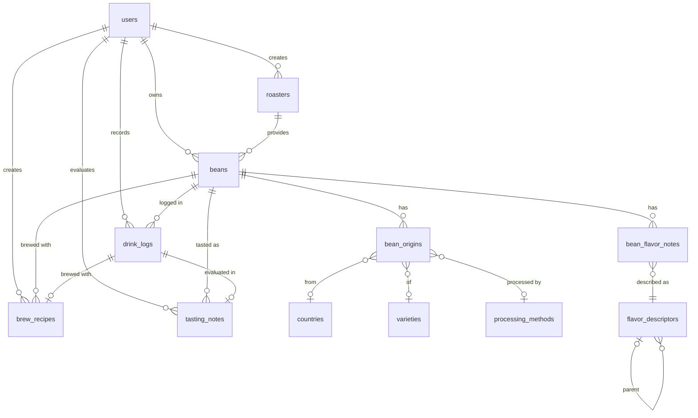

# データモデル仕様

## 概要

mamelog Flutter アプリのローカルデータモデル仕様を定義するリファレンスドキュメント。Drift (SQLite) のテーブル定義と、API 通信用の Freezed モデル定義に焦点を当てる。

## ローカル DB テーブル一覧

Drift (SQLite) に保持するテーブル。

### ユーザーデータ (soft delete)

| エンティティ         | テーブル名        | 説明                                       |
| -------------------- | ----------------- | ------------------------------------------ |
| ユーザー             | users             | Firebase Auth UID と紐付くユーザー情報     |
| ロースター           | roasters          | ユーザーが登録した焙煎所                   |
| コーヒー豆           | beans             | コーヒー豆の基本情報                       |
| 豆の産地情報         | bean_origins      | 豆の産地・品種・精製方法 (ジャンクション)  |
| 豆のフレーバーノート | bean_flavor_notes | beans と flavor_descriptors の中間テーブル |
| テイスティングノート | tasting_notes     | SCA カッピングプロトコル準拠の評価記録     |
| 抽出レシピ           | brew_recipes      | ハンドドリップ等の抽出条件                 |
| 飲んだ記録           | drink_logs        | 簡易評価 (星1-5) と感想メモ                |

### マスターデータ (読み取り専用)

API から取得しローカルにキャッシュする。アプリ側から変更しない。

| エンティティ     | テーブル名         | 説明                               |
| ---------------- | ------------------ | ---------------------------------- |
| 国               | countries          | コーヒー生産国 (ISO 3166-1)        |
| 品種             | varieties          | コーヒー品種 (アラビカ/ロブスタ等) |
| 精製方法         | processing_methods | 精製方法 + エイリアス              |
| フレーバー記述子 | flavor_descriptors | SCA Flavor Wheel 3階層ツリー       |

## Enum 定義

アプリ内で使用する Dart enum。

| Enum 名               | 値                                             |
| --------------------- | ---------------------------------------------- |
| roast_level           | LIGHT, MEDIUM_LIGHT, MEDIUM, MEDIUM_DARK, DARK |
| bean_type             | SINGLE_ORIGIN, BLEND                           |
| extraction_input_type | PHOTO, QR_CODE, URL                            |
| extraction_status     | PENDING, PROCESSING, COMPLETED, FAILED         |

## Drift テーブル定義

### 型マッピング

Drift (SQLite) / Dart で使用する型の対応表:

| データ種別 | Drift カラム型 | Dart 型     | 備考                      |
| ---------- | -------------- | ----------- | ------------------------- |
| UUID       | `text()`       | `String`    | UUIDv7 を文字列として保存 |
| テキスト   | `text()`       | `String`    | --                        |
| 整数       | `integer()`    | `int`       | --                        |
| 真偽値     | `boolean()`    | `bool`      | SQLite では 0/1 に変換    |
| 日付       | `text()`       | `String`    | `YYYY-MM-DD` 文字列で保存 |
| 日時       | `dateTime()`   | `DateTime`  | UTC で保存                |
| 小数       | `real()`       | `double`    | --                        |
| JSON       | `text()`       | `String`    | JSON 文字列として保存     |
| 配列       | `text()`       | `String`    | JSON 配列文字列として保存 |
| Enum       | `text()`       | Dart `enum` | Drift converter で変換    |

### 共通設計方針

- **PK:** 全テーブル UUIDv7 (`text()` カラム)。クライアント側で生成可能
- **soft delete:** `deleted_at` カラム (`dateTime().nullable()`)
- **共通カラム:** `created_at`, `updated_at` (`dateTime()`)

### Dart Enum 定義

```dart
/// 焙煎度
enum RoastLevel {
  light,
  mediumLight,
  medium,
  mediumDark,
  dark;

  String toDbValue() => switch (this) {
        RoastLevel.light => 'LIGHT',
        RoastLevel.mediumLight => 'MEDIUM_LIGHT',
        RoastLevel.medium => 'MEDIUM',
        RoastLevel.mediumDark => 'MEDIUM_DARK',
        RoastLevel.dark => 'DARK',
      };

  static RoastLevel fromDbValue(String value) => switch (value) {
        'LIGHT' => RoastLevel.light,
        'MEDIUM_LIGHT' => RoastLevel.mediumLight,
        'MEDIUM' => RoastLevel.medium,
        'MEDIUM_DARK' => RoastLevel.mediumDark,
        'DARK' => RoastLevel.dark,
        _ => throw ArgumentError('Unknown RoastLevel: $value'),
      };
}

/// 豆タイプ
enum BeanType {
  singleOrigin,
  blend;

  String toDbValue() => switch (this) {
        BeanType.singleOrigin => 'SINGLE_ORIGIN',
        BeanType.blend => 'BLEND',
      };

  static BeanType fromDbValue(String value) => switch (value) {
        'SINGLE_ORIGIN' => BeanType.singleOrigin,
        'BLEND' => BeanType.blend,
        _ => throw ArgumentError('Unknown BeanType: $value'),
      };
}

/// 抽出入力タイプ (API レスポンス用)
enum ExtractionInputType {
  photo,
  qrCode,
  url;

  static ExtractionInputType fromValue(String value) => switch (value) {
        'PHOTO' => ExtractionInputType.photo,
        'QR_CODE' => ExtractionInputType.qrCode,
        'URL' => ExtractionInputType.url,
        _ => throw ArgumentError('Unknown ExtractionInputType: $value'),
      };
}

/// 抽出ステータス (API レスポンス用)
enum ExtractionStatus {
  pending,
  processing,
  completed,
  failed;

  static ExtractionStatus fromValue(String value) => switch (value) {
        'PENDING' => ExtractionStatus.pending,
        'PROCESSING' => ExtractionStatus.processing,
        'COMPLETED' => ExtractionStatus.completed,
        'FAILED' => ExtractionStatus.failed,
        _ => throw ArgumentError('Unknown ExtractionStatus: $value'),
      };
}
```

### テーブルクラス定義

#### users

```dart
class Users extends Table {
  TextColumn get id => text()();
  TextColumn get firebaseUid => text().unique()();
  TextColumn get displayName => text().nullable()();
  TextColumn get avatarUrl => text().nullable()();
  TextColumn get email => text().nullable()();
  TextColumn get preferences => text().nullable()(); // JSON 文字列
  DateTimeColumn get createdAt => dateTime()();
  DateTimeColumn get updatedAt => dateTime()();
  DateTimeColumn get deletedAt => dateTime().nullable()();

  @override
  Set<Column> get primaryKey => {id};
}
```

#### roasters

```dart
class Roasters extends Table {
  TextColumn get id => text()();
  TextColumn get userId => text().references(Users, #id)();
  TextColumn get name => text()();
  TextColumn get nameReading => text().nullable()();
  TextColumn get location => text().nullable()();
  TextColumn get websiteUrl => text().nullable()();
  TextColumn get description => text().nullable()();
  DateTimeColumn get createdAt => dateTime()();
  DateTimeColumn get updatedAt => dateTime()();
  DateTimeColumn get deletedAt => dateTime().nullable()();

  @override
  Set<Column> get primaryKey => {id};
}
```

#### beans

```dart
class Beans extends Table {
  TextColumn get id => text()();
  TextColumn get userId => text().references(Users, #id)();
  TextColumn get roasterId => text().nullable().references(Roasters, #id)();
  TextColumn get name => text()();
  TextColumn get roastLevel => text().nullable()(); // RoastLevel enum
  TextColumn get beanType => text().nullable()(); // BeanType enum
  TextColumn get roastDate => text().nullable()(); // YYYY-MM-DD
  TextColumn get purchaseDate => text().nullable()(); // YYYY-MM-DD
  IntColumn get purchasePrice => integer().nullable()();
  IntColumn get weightG => integer().nullable()();
  BoolColumn get isDecaf => boolean().withDefault(const Constant(false))();
  TextColumn get description => text().nullable()();
  TextColumn get sourceUrl => text().nullable()();
  DateTimeColumn get createdAt => dateTime()();
  DateTimeColumn get updatedAt => dateTime()();
  DateTimeColumn get deletedAt => dateTime().nullable()();

  @override
  Set<Column> get primaryKey => {id};
}
```

#### bean_origins

```dart
class BeanOrigins extends Table {
  TextColumn get id => text()();
  TextColumn get beanId => text().references(Beans, #id)();
  TextColumn get countryId => text().nullable().references(Countries, #id)();
  TextColumn get region => text().nullable()();
  TextColumn get farm => text().nullable()();
  TextColumn get farmer => text().nullable()();
  TextColumn get varietyId => text().nullable().references(Varieties, #id)();
  TextColumn get processingMethodId =>
      text().nullable().references(ProcessingMethods, #id)();
  TextColumn get elevation => text().nullable()();
  TextColumn get harvestTime => text().nullable()();
  IntColumn get percentage => integer().nullable()();
  IntColumn get sortOrder => integer().withDefault(const Constant(0))();

  @override
  Set<Column> get primaryKey => {id};
}
```

#### bean_flavor_notes

```dart
class BeanFlavorNotes extends Table {
  TextColumn get beanId => text().references(Beans, #id)();
  TextColumn get flavorDescriptorId =>
      text().references(FlavorDescriptors, #id)();

  @override
  Set<Column> get primaryKey => {beanId, flavorDescriptorId};
}
```

#### tasting_notes

```dart
class TastingNotes extends Table {
  TextColumn get id => text()();
  TextColumn get userId => text().references(Users, #id)();
  TextColumn get beanId => text().references(Beans, #id)();
  TextColumn get drinkLogId =>
      text().nullable().references(DrinkLogs, #id)();
  TextColumn get protocolVersion =>
      text().withDefault(const Constant('classic'))();
  RealColumn get fragranceAroma => real().nullable()();
  RealColumn get flavor => real().nullable()();
  RealColumn get aftertaste => real().nullable()();
  RealColumn get acidity => real().nullable()();
  RealColumn get body => real().nullable()();
  RealColumn get balance => real().nullable()();
  RealColumn get uniformity => real().nullable()();
  RealColumn get cleanCup => real().nullable()();
  RealColumn get sweetness => real().nullable()();
  RealColumn get overall => real().nullable()();
  RealColumn get defects => real().withDefault(const Constant(0.0))();
  RealColumn get totalScore => real().nullable()();
  TextColumn get notes => text().nullable()();
  DateTimeColumn get createdAt => dateTime()();
  DateTimeColumn get updatedAt => dateTime()();
  DateTimeColumn get deletedAt => dateTime().nullable()();

  @override
  Set<Column> get primaryKey => {id};
}
```

#### brew_recipes

```dart
class BrewRecipes extends Table {
  TextColumn get id => text()();
  TextColumn get userId => text().references(Users, #id)();
  TextColumn get beanId => text().references(Beans, #id)();
  TextColumn get drinkLogId =>
      text().nullable().references(DrinkLogs, #id)();
  TextColumn get method => text().nullable()();
  TextColumn get equipment => text().nullable()();
  TextColumn get grindSize => text().nullable()();
  RealColumn get coffeeWeightG => real().nullable()();
  RealColumn get waterWeightG => real().nullable()();
  IntColumn get waterTemperatureC => integer().nullable()();
  IntColumn get brewTimeSeconds => integer().nullable()();
  TextColumn get notes => text().nullable()();
  DateTimeColumn get createdAt => dateTime()();
  DateTimeColumn get updatedAt => dateTime()();
  DateTimeColumn get deletedAt => dateTime().nullable()();

  @override
  Set<Column> get primaryKey => {id};
}
```

#### drink_logs

```dart
class DrinkLogs extends Table {
  TextColumn get id => text()();
  TextColumn get userId => text().references(Users, #id)();
  TextColumn get beanId => text().references(Beans, #id)();
  DateTimeColumn get drunkAt => dateTime()();
  IntColumn get rating => integer().nullable()(); // 1-5
  TextColumn get memo => text().nullable()();
  DateTimeColumn get createdAt => dateTime()();
  DateTimeColumn get updatedAt => dateTime()();
  DateTimeColumn get deletedAt => dateTime().nullable()();

  @override
  Set<Column> get primaryKey => {id};
}
```

#### countries

```dart
class Countries extends Table {
  TextColumn get id => text()();
  TextColumn get name => text().unique()();
  TextColumn get nameEn => text()();
  TextColumn get isoAlpha2 => text().unique()();
  TextColumn get region => text().nullable()();
  IntColumn get sortOrder => integer().withDefault(const Constant(0))();

  @override
  Set<Column> get primaryKey => {id};
}
```

#### varieties

```dart
class Varieties extends Table {
  TextColumn get id => text()();
  TextColumn get name => text().unique()();
  TextColumn get nameJa => text().nullable()();
  TextColumn get species => text().withDefault(const Constant('arabica'))();
  TextColumn get description => text().nullable()();
  IntColumn get sortOrder => integer().withDefault(const Constant(0))();

  @override
  Set<Column> get primaryKey => {id};
}
```

#### processing_methods

```dart
class ProcessingMethods extends Table {
  TextColumn get id => text()();
  TextColumn get name => text().unique()();
  TextColumn get nameJa => text().nullable()();
  TextColumn get aliases => text().nullable()(); // JSON 配列文字列
  TextColumn get description => text().nullable()();
  IntColumn get sortOrder => integer().withDefault(const Constant(0))();

  @override
  Set<Column> get primaryKey => {id};
}
```

#### flavor_descriptors

```dart
class FlavorDescriptors extends Table {
  TextColumn get id => text()();
  TextColumn get name => text()();
  TextColumn get nameJa => text().nullable()();
  TextColumn get parentId =>
      text().nullable().references(FlavorDescriptors, #id)();
  IntColumn get tier => integer()(); // 1, 2, 3
  TextColumn get scaReference => text().nullable()();
  IntColumn get sortOrder => integer().withDefault(const Constant(0))();

  @override
  Set<Column> get primaryKey => {id};
}
```

## Freezed モデル定義

API レスポンスのデシリアライズに Freezed + json_serializable を使用する。Drift テーブルとは別に、API 通信用のモデルを定義する。

### Extension Type による型安全 ID

各エンティティの ID を Extension Type で型安全にラップする:

```dart
extension type const BeanId(String value) implements String {
  factory BeanId.generate() => BeanId(Uuidv7().generate());
}

extension type const RoasterId(String value) implements String {
  factory RoasterId.generate() => RoasterId(Uuidv7().generate());
}

extension type const UserId(String value) implements String {
  factory UserId.generate() => UserId(Uuidv7().generate());
}

extension type const DrinkLogId(String value) implements String {
  factory DrinkLogId.generate() => DrinkLogId(Uuidv7().generate());
}

extension type const TastingNoteId(String value) implements String {
  factory TastingNoteId.generate() => TastingNoteId(Uuidv7().generate());
}

extension type const BrewRecipeId(String value) implements String {
  factory BrewRecipeId.generate() => BrewRecipeId(Uuidv7().generate());
}

extension type const ExtractionId(String value) implements String {}
extension type const CountryId(String value) implements String {}
extension type const VarietyId(String value) implements String {}
extension type const ProcessingMethodId(String value) implements String {}
extension type const FlavorDescriptorId(String value) implements String {}
```

### Beans レスポンスモデル

API レスポンスの `data` フィールドに含まれる Bean オブジェクト。origins と flavor_notes をネストする:

```dart
@freezed
class BeanResponse with _$BeanResponse {
  const factory BeanResponse({
    required BeanId id,
    RoasterSummary? roaster,
    required String name,
    @JsonKey(name: 'roast_level') RoastLevel? roastLevel,
    @JsonKey(name: 'bean_type') BeanType? beanType,
    @JsonKey(name: 'roast_date') String? roastDate,
    @JsonKey(name: 'purchase_date') String? purchaseDate,
    @JsonKey(name: 'purchase_price') int? purchasePrice,
    @JsonKey(name: 'weight_g') int? weightG,
    @JsonKey(name: 'is_decaf') @Default(false) bool isDecaf,
    String? description,
    @Default([]) List<BeanOriginResponse> origins,
    @JsonKey(name: 'flavor_notes')
    @Default([])
    List<FlavorDescriptorSummary> flavorNotes,
    @JsonKey(name: 'created_at') required DateTime createdAt,
    @JsonKey(name: 'updated_at') required DateTime updatedAt,
  }) = _BeanResponse;

  factory BeanResponse.fromJson(Map<String, dynamic> json) =>
      _$BeanResponseFromJson(json);
}

@freezed
class RoasterSummary with _$RoasterSummary {
  const factory RoasterSummary({
    required RoasterId id,
    required String name,
  }) = _RoasterSummary;

  factory RoasterSummary.fromJson(Map<String, dynamic> json) =>
      _$RoasterSummaryFromJson(json);
}

@freezed
class BeanOriginResponse with _$BeanOriginResponse {
  const factory BeanOriginResponse({
    CountrySummary? country,
    String? region,
    String? farm,
    VarietySummary? variety,
    @JsonKey(name: 'processing_method')
    ProcessingMethodSummary? processingMethod,
    String? elevation,
  }) = _BeanOriginResponse;

  factory BeanOriginResponse.fromJson(Map<String, dynamic> json) =>
      _$BeanOriginResponseFromJson(json);
}

@freezed
class CountrySummary with _$CountrySummary {
  const factory CountrySummary({
    required CountryId id,
    required String name,
    @JsonKey(name: 'iso_alpha2') required String isoAlpha2,
  }) = _CountrySummary;

  factory CountrySummary.fromJson(Map<String, dynamic> json) =>
      _$CountrySummaryFromJson(json);
}

@freezed
class VarietySummary with _$VarietySummary {
  const factory VarietySummary({
    required VarietyId id,
    required String name,
  }) = _VarietySummary;

  factory VarietySummary.fromJson(Map<String, dynamic> json) =>
      _$VarietySummaryFromJson(json);
}

@freezed
class ProcessingMethodSummary with _$ProcessingMethodSummary {
  const factory ProcessingMethodSummary({
    required ProcessingMethodId id,
    required String name,
  }) = _ProcessingMethodSummary;

  factory ProcessingMethodSummary.fromJson(Map<String, dynamic> json) =>
      _$ProcessingMethodSummaryFromJson(json);
}

@freezed
class FlavorDescriptorSummary with _$FlavorDescriptorSummary {
  const factory FlavorDescriptorSummary({
    required FlavorDescriptorId id,
    required String name,
    @JsonKey(name: 'name_ja') String? nameJa,
  }) = _FlavorDescriptorSummary;

  factory FlavorDescriptorSummary.fromJson(Map<String, dynamic> json) =>
      _$FlavorDescriptorSummaryFromJson(json);
}
```

### Extraction レスポンスモデル

LLM 抽出結果の API レスポンスモデル。ローカル DB には保存せず、API からの受信専用。

```dart
@freezed
class ExtractionResponse with _$ExtractionResponse {
  const factory ExtractionResponse({
    required ExtractionId id,
    required ExtractionStatus status,
    @JsonKey(name: 'input_type') required ExtractionInputType inputType,
    BeanResponse? bean,
    @JsonKey(name: 'confidence_scores')
    Map<String, double>? confidenceScores,
    @JsonKey(name: 'error_message') String? errorMessage,
    @JsonKey(name: 'created_at') required DateTime createdAt,
  }) = _ExtractionResponse;

  factory ExtractionResponse.fromJson(Map<String, dynamic> json) =>
      _$ExtractionResponseFromJson(json);
}
```

`confidence_scores` のキーと意味:

| キー             | 説明               | 閾値                         |
| ---------------- | ------------------ | ---------------------------- |
| `bean_name`      | コーヒー名の信頼度 | < 0.5 でユーザーに確認を促す |
| `roast_level`    | 焙煎度の信頼度     | 同上                         |
| `origin_country` | 産地・国の信頼度   | 同上                         |
| `variety`        | 品種の信頼度       | 同上                         |
| `process`        | 精製方法の信頼度   | 同上                         |
| `flavor_notes`   | フレーバーの信頼度 | 同上                         |

## ER 図

ローカル DB の全12テーブルの関連図。



## マスターデータ

API から取得しローカルにキャッシュするマスターデータの概要。

### countries (~70カ国)

ISO 3166-1 からコーヒー生産国をフィルタリング。

| 地域            | 主要国例                                                     |
| --------------- | ------------------------------------------------------------ |
| Africa          | エチオピア, ケニア, タンザニア, ルワンダ, ブルンジ, コンゴ   |
| Central America | グアテマラ, コスタリカ, パナマ, ホンジュラス, エルサルバドル |
| South America   | コロンビア, ブラジル, ペルー, ボリビア                       |
| Asia/Pacific    | インドネシア, ベトナム, インド, パプアニューギニア, 中国     |

### varieties (~50品種)

主要なアラビカ/ロブスタ品種。

| 種      | 代表品種例                                                    |
| ------- | ------------------------------------------------------------- |
| arabica | Typica, Bourbon, Gesha, SL28, SL34, Caturra, Catuai, Heirloom |
| robusta | Robusta                                                       |

### processing_methods (~10種 + aliases)

標準的な精製方法とエイリアス。

| 精製方法    | エイリアス例              |
| ----------- | ------------------------- |
| Washed      | Wet Process, Fully Washed |
| Natural     | Dry Process, Sun Dried    |
| Honey       | Pulped Natural            |
| Anaerobic   | Anaerobic Fermentation    |
| Wet Hulled  | Giling Basah              |
| Semi-Washed | Semi-Lavado               |

### flavor_descriptors (SCA Flavor Wheel 3階層, ~110記述子)

SCA Coffee Taster's Flavor Wheel に基づく隣接リスト (adjacency list) モデル。

| 階層   | 数  | 例                                     |
| ------ | --- | -------------------------------------- |
| Tier 1 | 9   | Fruity, Floral, Sweet, Nutty/Cocoa ... |
| Tier 2 | ~30 | Berry, Citrus, Stone Fruit ...         |
| Tier 3 | ~70 | Blueberry, Lemon, Peach ...            |

## 関連ドキュメント

- [アーキテクチャ設計](architecture.md) -- レイヤー構成、状態管理、DI、データフロー
- [開発ガイド](development-guide.md) -- 環境構築、コード生成、テスト
- [黄金原則](golden-principles.md) -- ドキュメント品質基準
- [機械的強制ルール](enforcement.md) -- リンター・CI で自動検証されるルール
